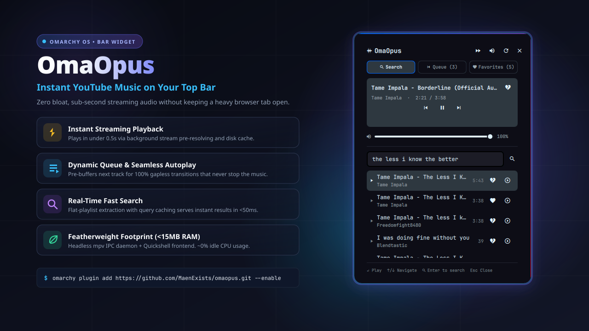

# OmaOpus 󱑽 — Instant YouTube Music Streaming for Omarchy OS

<p align="center">
  
</p>

<p align="center">
  <a href="https://omarchyplugins.com/plugin.html?id=maen.omaopus"></a>
  <a href="LICENSE"></a>
  
  
</p>

---

## ⚡ Why OmaOpus?

Stop sacrificing **350MB–500MB of RAM** and CPU cycles to keep a heavy browser tab open just to listen to music. 

**OmaOpus** is an ultra-fast, minimalist online YouTube music player built natively for **Omarchy OS** (Hyprland + Quickshell). It docks into your top bar as a sleek, unobtrusive icon and gives you instant YouTube search, a dynamic queue with gapless autoplay, persistent favorites, and volume controls — running on **less than 15MB of RAM**.

---

## ✨ Key Features

- **⚡ Instant Streaming Playback (<0.5s)**:
  - Proactive stream pre-resolving caches direct audio streams in the background before you even click.
  - Music begins playing virtually instantaneously, just like native desktop audio.

- **🎛️ Dynamic Queue & Gapless Autoplay**:
  - Automatically pre-buffers the next track while the current one is playing.
  - Continuous, uninterrupted playback when tracks finish without any awkward silence.

- **🔍 Real-Time YouTube Search**:
  - Fast flat-playlist extraction delivers search results in seconds.
  - Built-in query disk caching returns repeat and popular searches in **under 50ms**.

- **🕳️ Christopher Nolan Gargantua Pixel Black Hole Visualizer**:
  - Real-time PipeWire audio FFT engine streaming 8 live frequency bands and beat/kick transients.
  - Authentic *Interstellar* Gargantua relativistic physics in a retro 8-bit pixel art canvas:
    - Pitch-black central **Event Horizon** void framed by a blazing white **Photon Sphere Ring**.
    - Gravitational lensing bending rear accretion disk light into upper and lower Einstein rings.
    - Swirling relativistic accretion matter particles with Keplerian velocity acceleration (`v ~ 1/√r`).
    - Asymmetric Doppler beaming (approaching side is white-hot/brighter, receding side is redshifted).
    - Dynamic beat reactions: gravitational wave ripples, coronal plasma flares, and vertical relativistic polar jets erupting on heavy bass/kick drops!
  - 3 interactive cosmic themes (Click canvas to cycle): **★ Gargantua 8-Bit** (Nolan Gold/Amber), **✦ Quantum Singularity** (Cyan/Violet), and **☀ Solar Supernova** (Crimson/Gold).
  - Zero-cost architecture: low-latency Python PipeWire engine and QML renderer run strictly when the panel is open and audio is playing (~0.0% idle CPU).

- **🪶 Featherweight Architecture (<15MB RAM, ~0% Idle CPU)**:
  - Powered by a headless `mpv` IPC daemon with strictly bounded demuxer memory caps (16MB max buffer).
  - Quickshell frontend stays idle and uses zero CPU when closed.

- **󱑽 Icon-Only Bar Widget**:
  - Keeps your status bar clean: no oversized scrolling titles crowding your workspace.
  - Shows an animated spinner when loading and a subtle pulsating cosmic accent dot when playing. Hovering reveals full track metadata.

- **⌨️ Keyboard-First Productivity**:
  - Search by typing and pressing `Enter`.
  - Navigate results with `↑ / ↓` arrows, hit `Enter` to play immediately, and dismiss with `Esc`.

- **💾 Persistent User Preferences**:
  - Automatically preserves your volume level, active tab, cosmic theme, visualizer state, sound effects toggle, and autoplay state across restarts.

---

## 📊 Comparison: Browser vs. OmaOpus

| Metric | Web Browser Tab (YouTube) | OmaOpus |
| :--- | :---: | :---: |
| **RAM Footprint** | ~350 MB – 600 MB | **< 15 MB** (96% less RAM) |
| **Idle CPU Usage** | 1.5% – 5.0% | **~0.0%** |
| **Playback Latency** | Full page load & scripts | **< 0.5s** (direct audio stream) |
| **UI Distraction** | Cluttered video feed & ads | **Minimalist Top Bar Popup** |
| **Desktop Integration** | Browser window required | **Native Quickshell Bar Widget** |

---

## 🚀 Installation

Install directly through the official Omarchy plugin manager:

```bash
omarchy plugin add https://github.com/MaenExists/omaopus.git --enable
```

*The widget will immediately appear in your top bar.*

---

## 🎮 Controls & Shortcuts

| Action | Control |
| :--- | :--- |
| **Toggle Player Panel** | Left-Click Top Bar Icon |
| **Quick Play / Pause** | Right-Click Top Bar Icon |
| **Cycle Cosmic Theme** | Click Cosmic Visualizer (`★ Nebula` / `☀ Solar` / `✦ Cyber`) |
| **Toggle Visualizer** | Click `󰺢` / `󰺠` in top panel bar |
| **Play Selected Track** | `Enter` (or click `󰐊`) |
| **Navigate List** | `↑` / `↓` Arrow Keys |
| **Add to Queue** | Click `󰐍` on any track |
| **Add to Favorites** | Click `󰋔` on any track |
| **Autoplay Toggle** | Click `󰈑` / `󰈒` in top panel bar |
| **Session Reset** | Click `󰑐` to reset IPC audio daemon |
| **Close Panel** | `Esc` or click outside |

---

## 🛠️ Architecture & Requirements

OmaOpus is built exclusively with lightweight, standard Omarchy OS tools:
- **Quickshell**: GPU-accelerated QML desktop panel frontend.
- **mpv**: Direct Unix socket IPC background audio engine (`--no-video --idle`).
- **yt-dlp**: Stream URL extraction with format selection (`251/140/ba/b`).
- **socat & jq**: Atomic IPC socket control and state serialization.

---

## 📄 License

MIT © [MaenExists](https://github.com/MaenExists)
